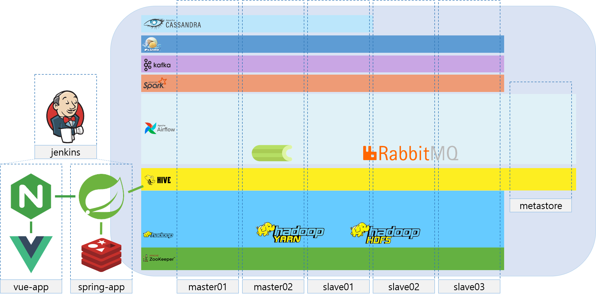
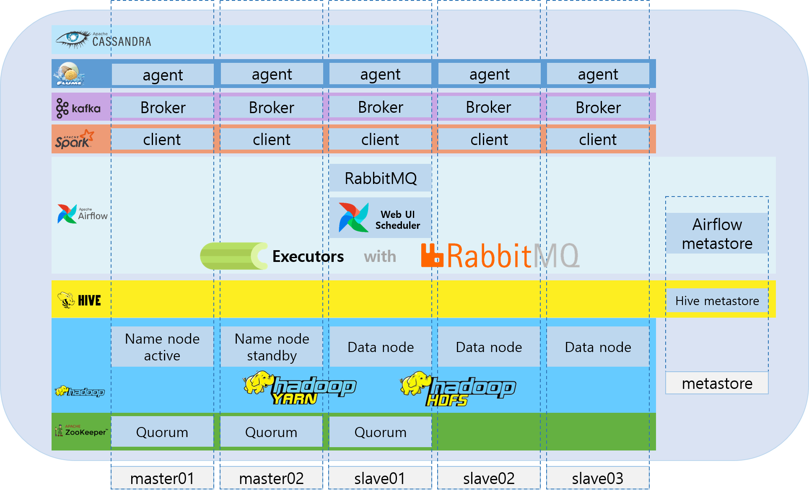
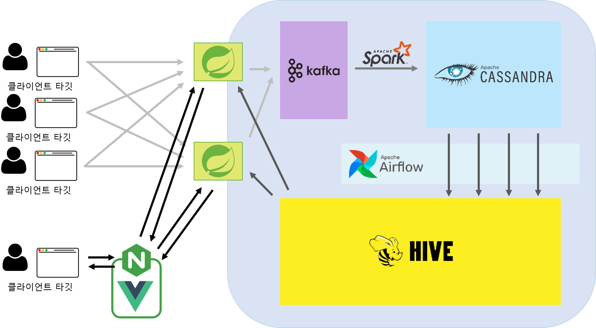

# SSAFY 특화 프로젝트
## 팀 마타(A506)

# 🌐 MATA 링크 : [대시보드 링크](http://ec2-3-38-85-143.ap-northeast-2.compute.amazonaws.com/)

# 🎞 소개 영상 보기 :

# 📆 프로젝트 진행 기간

2023/02/20 ~ 2023/04/07

# 📖 MATA 는 무엇인가요?

## 🗻Our Vision

웹 페이지의 UX를 향상시키기 위해 고객의 동선을 파악하여

고객 여정 지도를 그리는 것은 비즈니스 차원에서 필수입니다.

서비스에 접근하는 모든 고객의 동선을 수집하여 이를 자동화 하고  

클라이언트의 각종 업무를 돕는것이 MATA의 역할입니다.

## 🎯Our Solution

웹 사이트 이용자의 사이트 내 동선 데이터를 수집합니다.  

수집된 데이터를 처리, 변환하여 적재합니다.  

사이트 관리자 및 운영자에게 사이트 내 흐름에 대한 시각화 정보를 제공합니다.

## 💎Our Value

웹 사이트의 발전과 성장을 위한 인사이트를 제공합니다.

# 💜 주요 기능

---

### 컴포넌트 별 통계

이미지

### ~~~ 별 통계

이미지

### ~~~ 별 통계

이미지

# ✔ 주요 기술

---

**Data cluster - Hadoop Ecosystem**

Hadoop

Zookeeper

Kafka

Spark

Cassandra

Hive

Airflow

MySQL

**Backend - Spring**

Spring Boot

Spring Web

JPA

JDBC Template

JWT

Spring Security

Spring for Kafka

**Frontend**

Vue

Bootstrap

**Database**

MySQL

Redis

Hive

**CI/CD**

AWS EC2

NginX

Jenkins

Docker

Docker Compose

# ✔ 프로젝트 아키텍쳐

---
## MATA Architecture


## Data Cluster Architecture


## Data Flow


# ✔ 프로젝트 구조

---

## 디렉토리 설명

### `react-app`
- React 애플리케이션
- 웹사이트 로그 생성 역할
- 테스트용 서버

### `bigdata-api`
- Springboot 애플리케이션
- React 앱 혹은 html에서 전달된 데이터를 받아오고 접근 권한을 부여하는 역할
- Kafka server에 데이터를 넘겨주는 역할
- Hive, MySQL 등 DB에서 API를 통해 데이터를 조회하는 역할

### `vue3`
- Vue 애플리케이션
- 대쉬보드 페이지 서버

### `hadoop-cluster`
- Hadoop Ecosystem 스크립트
- Kafka, Hive, Airflow 등 다양한 툴을 가지는 분산 데이터 플랫폼
- Docker 기반 분산 운영

### `Docs`
- 개인공부, 회의록 등 문서를 정리한 공간

## 디렉토리 구조

### Frontend

```
FRONTEND\VUE3\SRC
├─assets
│  ├─base
│  ├─images
│  │  └─flags
│  └─sass
│      ├─apps
│      ├─authentication
│      ├─components
│      │  ├─cards
│      │  │  └─_card
│      │  ├─tabs-accordian
│      │  └─timeline
│      │      └─_timeline
│      ├─drag-drop
│      ├─elements
│      │  └─_infobox
│      ├─font-icons
│      │  └─fontawesome
│      │      ├─css
│      │      └─webfonts
│      ├─forms
│      ├─pages
│      │  ├─coming-soon
│      │  ├─error
│      │  ├─faq
│      │  └─privacy
│      ├─tables
│      ├─users
│      ├─widgets
│      └─_structure
├─components
│  ├─layout
│  └─plugins
├─composables
├─layouts
├─locales
├─router
├─store
└─views
    ├─apps
    │  └─invoice
    ├─auth
    ├─charts
    ├─pages
    └─users
```

### Backend

```
BACKEND\BIGDATA-API
├─mata-api-server
│  └─src
│      └─main
│          ├─java
│          │  └─com
│          │      └─ssafy
│          │          ├─common
│          │          │  └─exception
│          │          │      └─dto
│          │          ├─config
│          │          │  └─sercurity
│          │          └─controller
│          └─resources
├─mata-hive
│  └─src
│      └─main
│          └─java
│              └─com
│                  └─ssafy
│                      ├─config
│                      ├─entity
│                      ├─repository
│                      └─service
├─mata-mysql
│  ├─META-INF
│  └─src
│      └─main
│          ├─java
│          │  └─com
│          │      └─ssafy
│          │          ├─common
│          │          │  └─validation
│          │          ├─dto
│          │          │  ├─member
│          │          │  │  ├─exception
│          │          │  │  ├─request
│          │          │  │  └─response
│          │          │  └─project
│          │          │      ├─exception
│          │          │      ├─request
│          │          │      └─response
│          │          ├─entity
│          │          │  └─enums
│          │          ├─repository
│          │          │  ├─member
│          │          │  └─project
│          │          ├─service
│          │          └─token
│          └─resources
│              └─META-INF
```

### Data Cluster

```
FRONTEND\VUE3\SRC
├─client
│  └─notebook
│      └─.ipynb_checkpoints
├─lib
│  ├─apache-airflow-2.5.0
│  │  ├─conf
│  │  ├─dags
│  │  │  ├─lib
│  │  │  │  ├─extract
│  │  │  │  │  └─__pycache__
│  │  │  │  ├─spark
│  │  │  │  └─__pycache__
│  │  │  └─__pycache__
│  │  └─logs
│  ├─apache-cassandra-4.0.8
│  │  └─conf
│  ├─apache-flume-1.11.0-bin
│  │  └─conf
│  ├─apache-hive-3.1.3-bin
│  │  └─conf
│  ├─apache-zookeeper-3.7.1-bin
│  │  ├─conf
│  │  └─sbin
│  ├─hadoop-3.3.4
│  │  └─etc
│  │      └─hadoop
│  ├─kafka_2.12-3.4.0
│  │  ├─config
│  │  └─sbin
│  └─spark-3.3.2-bin-hadoop3
│      ├─conf
│      └─jobs
├─node
└─sbin
```

# ✔ 협업

---

### Jira 를 통한 협업

- 프로젝트를 진행하며 1주당 하나의 스프린트, 총 5개의 스프린트를 진행
- 한 주의 시작마다 인당 총 40시간의 이슈를 생성하고 스프린트를 시작
- 1~4시간의 이슈를 생성하여 작업을 시작할 때 마다 해당 이슈를 진행중 표시
- 작업이 완료 되면 해당 이슈를 완료 표시 한 후, 다음 작업을 진행
- 한 주의 마지막에 스프린트를 종료하여 리뷰하는 시간을 가짐

### Gitlab 을 통한 협업

- master, develop, feature의 git flow 브랜칭 전략을 통해 작업 브랜치를 분할 관리
- 새로운 기능 개발이나 버그픽스를 위해 feature 브랜치를 사용
- 개발 현황을 병합하고 새로운 개발 브랜치를 분기하기 위해 develop 브랜치를 사용

# ✔ 팀원 역할 분배

---

### 이태희 (팀장)

`Frontend` `Backend` `System`

데이터 플랫폼 아키텍쳐 설계

실시간 ETL 파이프라인 개발

### 김태영


### 김호성

### 박건우

### 이인재

### 정준호

# ✔ 프로젝트 산출물

---
- [서비스 ERD](Docs/서비스%20ERD.png)
- [Hive ERD](Docs/Hive%20ERD.png)
- [서비스 API 목록](Docs/API%20목록.html)
- [최종 발표 PPT]()
- [포딩 매뉴얼]()

# 📊 MATA 대시보드 화면

---


